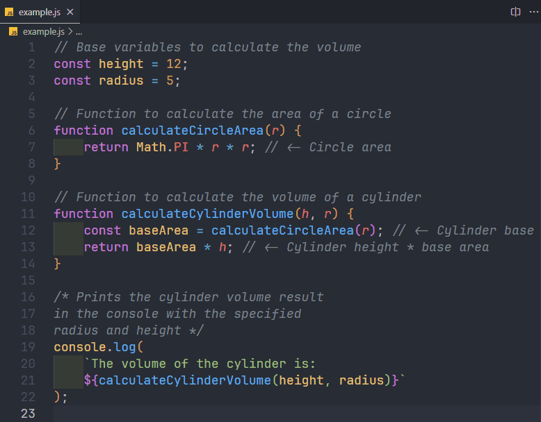

# toggle-comments-visibility README

Toggle Comments Visibility allows you to hide and show comments in your code with a custom shortcut in VS Code.

## Features

Hide your comments to have cleaner code and show comments again only when necessary using
the shortcut `Ctrl+K Ctrl+H`.

## Requirements

No additional requirements.

## Extension Settings

This extension contributes the following settings:

* `toggleComments.enable`: Enable or disable this extension.

## Known Issues

No know issues at the moment.

If you encounter any issues, please report them on the [GitHub repository issues page](https://github.com/BeruzDev/vsc_extension_toggle_comments/issues).

## Release Notes

### 1.0.0

- Initial release of Toggle Comments Visibility
- Allows users to hide and show comments with a custom keyboard shortcut (`Ctrl+K Ctrl+H`).

---

## Following extension guidelines

Ensure that you've read through the extensions guidelines and follow the best practices for creating your extension.

* [Extension Guidelines](https://code.visualstudio.com/api/references/extension-guidelines)

## For more information

* [Visual Studio Code's Markdown Support](http://code.visualstudio.com/docs/languages/markdown)
* [Markdown Syntax Reference](https://help.github.com/articles/markdown-basics/)

**Enjoy!**
